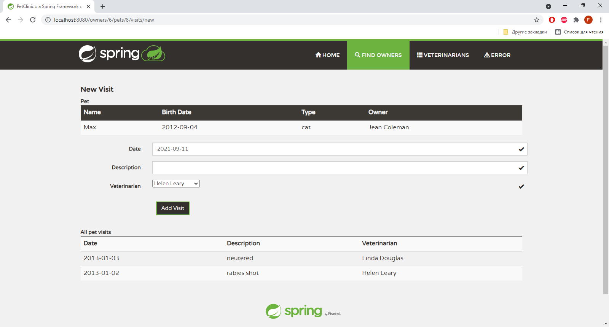
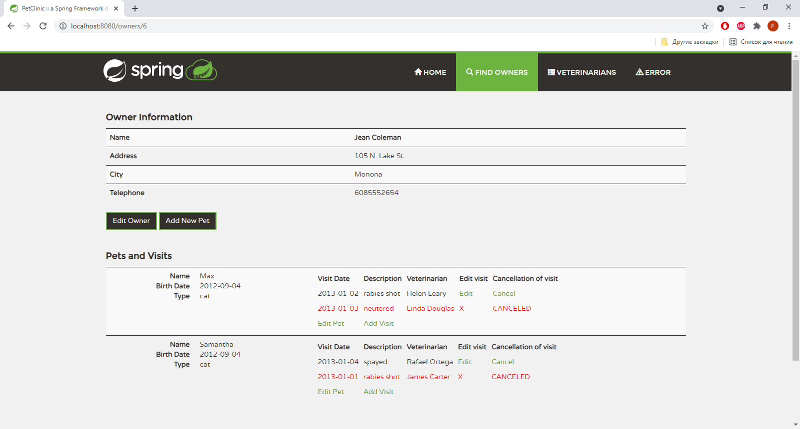

Запускается проект также как и у его прародителя.
Реализация по пунктам:
1)Реализовано.

2)Реализованно. 
3)Реализованно. 
4)Реализованно.

Также по четвёртому пункту не было понятно можно ли редактировать 
отменённый приём, для этого в git есть предыдущую версию под названием
"add cancellation and modification" в этой версии можно редактировать 
отменённый приём. А в более предыдущей версии "add a visit with the veterinarian"
т.к. был невнимательно прочитан 4-й пункт имеется просто возможность просто
удаление визита.
